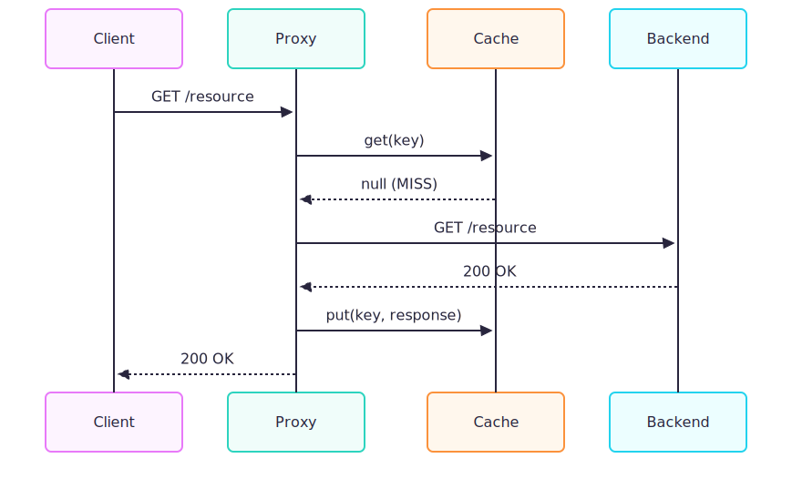
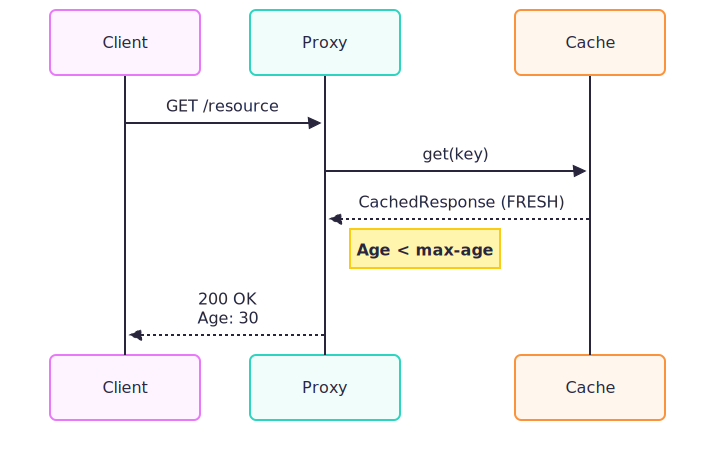
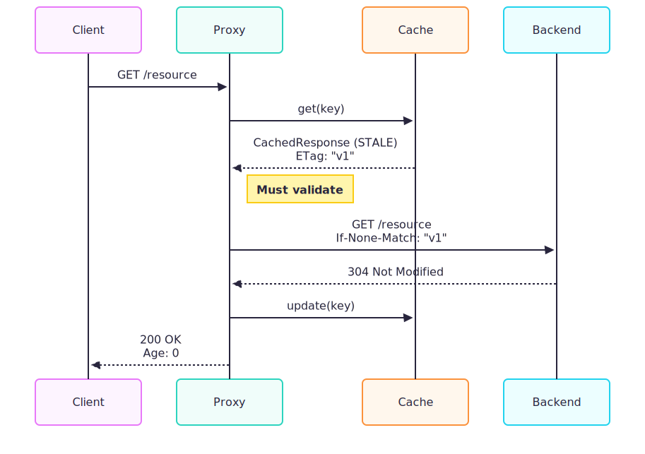
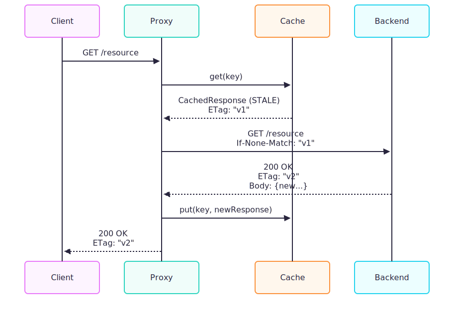
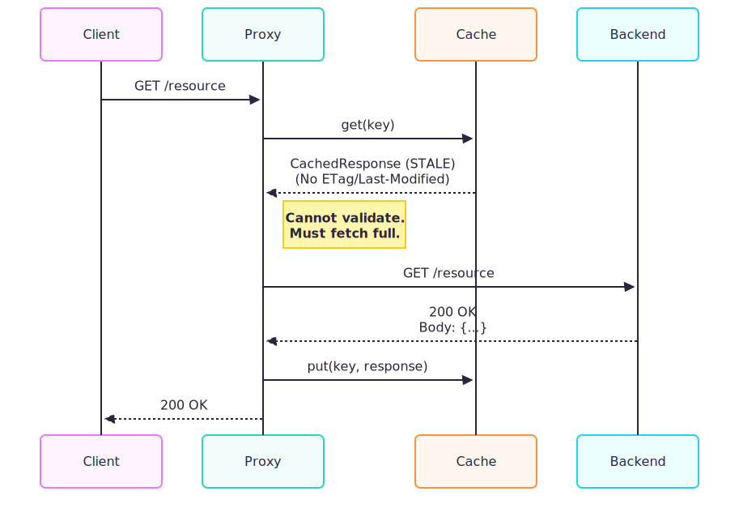

# Reverse Proxy

A production-ready, reactive (non-blocking) HTTP reverse proxy built with Spring Boot WebFlux (Netty), featuring host-based routing, multiple load-balancing strategies, and RFC 7234-compliant caching with conditional revalidation (ETag / Last-Modified).

[](https://openjdk.java.net/projects/jdk/17/)
[](https://spring.io/projects/spring-boot)
[](https://docs.spring.io/spring-framework/reference/web/webflux.html)

## Table of Contents
1. [Overview](#overview)
2. [Architectural Design](#architectural-design)
3. [Request Flow](#request-flow)
4. [Sequence Diagrams](#sequence-diagrams)
5. [Getting Started](#getting-started)
6. [Configuration](#configuration)
7. [Load Balancing](#load-balancing)
8. [Caching](#caching)
9. [Testing](#testing)

---

## Overview

This service acts as a **high-performance reverse proxy** that receives inbound HTTP requests and intelligently routes them to downstream services based on the request's `Host` header. It leverages Spring WebFlux's reactive architecture to handle thousands of concurrent connections with minimal resource overhead.


**Tech Stack**
- **Java 17** - Modern LTS version with performance improvements
- **Spring Boot 4.0.2** - Latest stable release
- **Spring WebFlux** - Reactive stack with non-blocking I/O
- **Netty Runtime** - High-performance async event-driven network framework
- **Maven** - Build automation (wrapper included)

---

## Architectural Design

The system is architected as a high-throughput **Reactive Reverse Proxy**, leveraging the **Reactor** pattern to handle I/O operations asynchronously.

*   **⚡ Non-Blocking Event Loop**: Built on **Netty** and **Spring WebFlux**, the proxy uses a fixed number of event loop threads rather than a "thread-per-request" model. This architecture minimizes context switching and memory overhead, enabling the handling of thousands of concurrent connections.
*   **⚖️ Pluggable Load Balancing Strategy**: Routing logic implements the *Strategy Pattern* via the `LoadBalancer` interface. This decoupling allows distinct algorithms (e.g., Round-Robin, Random) to be applied per-service in `application.yml` without code changes.
*   **💾 RFC-Compliant Caching Layer**: The caching subsystem acts as a transparent shared cache (RFC 7234). It uses `ConcurrentLinkedHashMap` for thread-safety and implements complex validation logic (handling `ETag`, `Last-Modified`) and response variations via the `Vary` header, strictly adhering to HTTP standards.
*   **🔧 Protocol Compliance Engine**: A dedicated filter chain enforces strict HTTP compliance. It manages `X-Forwarded-*` headers for client traceability and proactively validates and strips Hop-by-Hop headers (e.g., `Connection`, `Te`) to ensure protocol integrity and prevent ambiguity.


## Request Flow

1.  **Incoming Request**: Netty accepts the connection.
2.  **Routing**: `ServiceRegistry` identifies the target backend service based on the `Host` header.
3.  **Cache Lookup**: `CacheService` checks for a valid response (Non-blocking access).
4.  **Load Balancing**: If not cached, `LoadBalancer` selects a specific backend host.
5.  **Proxying**: `WebClient` forwards the request asynchronously.
6.  **Response Handling**: The response is streamed back to the client and asynchronously stored in the cache.

---

## Sequence Diagrams

These diagrams illustrate the detailed interactions between components for common scenarios.

### 1. Cache MISS (First Request)
The proxy forwards the request and stores the response.



### 2. Cache HIT (Fresh)
The cached resource is within `max-age`. No backend contact needed.



### 3. Cache Revalidation - Not Modified (304)
Resource is stale (`Age > max-age`) but has validators (`ETag`). Backend confirms it's unchanged.


### 4. Cache Revalidation - Modified (200)
Resource is stale and HAS changed on the backend.



### 5. Stale Cache without Validators
Resource is stale but has NO `ETag` or `Last-Modified`. Must re-download fully.


---

## Load Balancing

### Available Strategies

#### Round-Robin
Distributes requests sequentially across all hosts in a circular order. Ideal for stateless services with even capacity.

#### Random
Selects a random host for each request. Good for simple load distribution without state maintenance.


## Caching

Implements RFC 7234 compliant HTTP caching.

### Supported Features
*   **Validation**: Conditional requests using `ETag` and `Last-Modified`.
*   **Directives**: Support for `Cache-Control` directives (`public`, `private`, `no-cache`, `no-store`, `max-age`, `s-maxage`).
*   **Vary Support**: Caches different responses based on `Vary` headers.
*   **Eviction**: Thread-safe LRU eviction policy.

### Cache Architecture

```
┌──────────────────────────────────────┐
│         CacheService                 │
│  ┌────────────────────────────────┐  │
│  │    ConcurrentLinkedHashMap     │  │
│  │         (LRU Eviction)         │  │
│  └────────────────────────────────┘  │
│              ▲         │              │
│              │         ▼              │
│         CacheKey   CachedResponse    │
└──────────────────────────────────────┘
```

### Cache Key Composition

Cache keys are composite to support `Vary` header:

```
CacheKey = {
  method: String          // GET, HEAD
  url: String            // Full request URL
  varyHeaders: Map       // Headers specified in Vary
}
```
